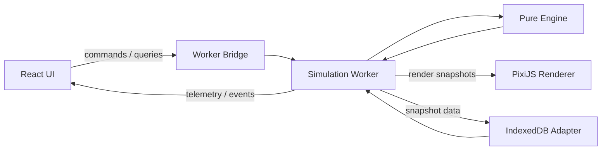

# 02 — Technical Architecture and Worker Protocol

## 1. Priorities

1. deterministic authoritative engine;
2. isolation from presentation;
3. headless throughput;
4. smooth 2D renderer;
5. local persistence/replay;
6. mobile-ready web architecture;
7. future server/WASM portability.

## 2. High-level architecture



## 3. Runtime ownership

### Main thread

Owns:

- React UI;
- Pixi render loop;
- pointer/touch input;
- camera;
- low-frequency charts;
- worker lifecycle;
- world list/save UX.

Does not run authoritative simulation.

### Simulation Worker

Owns:

- one authoritative engine instance;
- fixed-tick scheduling;
- speed control;
- command queue;
- headless fast-forward;
- telemetry/events;
- render snapshot generation;
- serialization orchestration.

### Pure engine

Knows nothing about Workers, browser, Pixi, React, persistence or real time.

## 4. Dependency boundaries

Suggested workspace:

```text
apps/web
packages/engine
packages/protocol
packages/renderer
packages/persistence
packages/ui
packages/shared
```

Rules:

- protocol DTOs contain no browser classes;
- renderer may depend on protocol/shared, never engine internals;
- persistence can store engine snapshots but not decide rules;
- app composes all dependencies.

## 5. Renderer choice

Use PixiJS 8.x directly.

Do not put thousands of organisms through React reconciliation.

Use:

- coarse terrain texture;
- `ParticleContainer` for large lightweight organism layer;
- close-up detail layer for a limited number of organisms;
- application-level LOD/culling where profiling justifies it.

WebGPU is optional; maintain compatibility with supported Pixi renderer fallback paths.

## 6. Why TypeScript first

Do not start with Rust/WASM.

TypeScript + Worker + SoA + spatial grid + quantized NN should be tested first. Port only a measured hot module if targets cannot be met after normal optimization.

## 7. Fixed-step engine API

Conceptual API:

```ts
interface SimulationEngine {
  readonly tick: number;
  step(): void;
  stepMany(count: number): void;
  applyCommand(command: SimulationCommand): CommandResult;
  queryEntity(id: number): EntityDetails | null;
  querySpecies(id: number): SpeciesDetails | null;
  writeRenderSnapshot(writer: RenderSnapshotWriter): void;
  serialize(): EngineSnapshot;
}
```

No `deltaTime` argument.

## 8. Worker scheduler

At 1× target 20 simulation ticks/s.

Requested modes:

```text
PAUSED 0
1x      20 ticks/s
5x     100 ticks/s
20x    400 ticks/s
100x  2000 ticks/s
MAX   unpaced
```

If hardware cannot sustain target, run as fast as possible and report actual TPS.

At MAX:

- process tick batches for ~8–12 ms;
- yield to Worker event loop;
- emit render snapshots at reduced rate, e.g. 3–8 Hz;
- never alter simulation equations.

## 9. Authoritative versus derived state

Authoritative and saved:

- current tick;
- PRNG state;
- environment arrays;
- organisms + genomes + brains;
- carcasses;
- species registry and split candidates;
- next entity/species IDs;
- command cursor/queue state;
- statistics accumulators used by event logic;
- config.

Derived and recreated:

- Pixi objects;
- camera;
- screen coordinates;
- terrain GPU texture;
- hover state;
- chart geometry;
- profiling wall-clock values.

## 10. Render transport

Do not send one JSON object per organism per frame.

Use TypedArrays / transferable buffers.

Suggested display arrays:

```ts
ids: Uint32Array
x: Float32Array
y: Float32Array
rotation: Float32Array
scaleX: Float32Array
scaleY: Float32Array
tint: Uint32Array
speciesId: Uint32Array
detailFlags: Uint16Array
```

These are renderer floats derived from authoritative fixed-point state.

Implement a reusable 2–3 buffer pool after the first vertical slice if profiling shows allocation/GC pressure.

Do not require `SharedArrayBuffer` in MVP.

## 11. Data-flow separation

### High frequency

`RENDER_SNAPSHOT`

### Low frequency

`TELEMETRY`

Includes population/species/biomass/births/deaths/achieved TPS/phase timings.

### On demand

- entity details;
- species details;
- tree;
- history range.

### Events

- intervention;
- species split;
- extinction;
- first predation;
- boom/crash;
- mass extinction;
- cap warning.

## 12. Protocol envelope

```ts
interface Envelope<T extends string, P> {
  protocolVersion: number;
  requestId?: number;
  type: T;
  payload: P;
}
```

Hot binary render messages can use specialized shape.

## 13. Main -> Worker messages

Required:

- `INIT_NEW_WORLD`
- `LOAD_WORLD`
- `SET_RUN_STATE`
- `QUEUE_COMMAND`
- `QUERY_ENTITY`
- `QUERY_SPECIES`
- `REQUEST_TREE`
- `REQUEST_HISTORY_RANGE`
- `REQUEST_SAVE`
- `REQUEST_REWIND`
- `CREATE_BRANCH`
- `RECYCLE_RENDER_BUFFER` if pooling enabled.

## 14. Worker -> Main messages

Required:

- `WORLD_READY`
- `RENDER_SNAPSHOT`
- `TELEMETRY`
- `WORLD_EVENT`
- `ENTITY_DETAILS`
- `SPECIES_DETAILS`
- `TREE_SNAPSHOT` / later diff;
- `SAVE_COMPLETED`
- `REWIND_PROGRESS`
- `HISTORICAL_MODE_READY`
- `ERROR`.

## 15. Player command contract

```ts
interface CommandBase {
  schemaVersion: 1;
  id: number;
  tick: number;
  sequence: number;
  type: string;
}
```

Commands immutable after acceptance.

MVP union:

- `SET_GLOBAL_TEMPERATURE_OFFSET`
- `PAINT_TEMPERATURE`
- `PAINT_MOISTURE`
- `PAINT_FERTILITY`
- `RAISE_TERRAIN`
- `LOWER_TERRAIN`
- `ADD_BIOMASS`
- `REMOVE_BIOMASS`
- `METEOR`
- `TRANSLOCATE_ORGANISMS` late-MVP.

## 16. Deterministic brush strokes

Raw pointermove frequency differs per device and must not directly become simulation commands.

Process:

1. capture geometric path in UI;
2. on stroke completion resample at fixed world-distance spacing;
3. quantize coordinates;
4. create ordered command samples;
5. assign tick/sequence deterministically;
6. Worker validates and records.

Brush:

```ts
interface RadialBrush {
  centerX: number;
  centerY: number;
  radiusLU: number;
  strengthQ: number;
  falloff: "linear" | "hard";
}
```

## 17. Config contract

```ts
interface SimulationConfig {
  schemaVersion: number;
  world: WorldConfig;
  time: TimeConfig;
  plants: PlantConfig;
  organism: OrganismConfig;
  senses: SenseConfig;
  brain: BrainConfig;
  mutation: MutationConfig;
  combat: CombatConfig;
  reproduction: ReproductionConfig;
  species: SpeciesConfig;
  history: HistoryConfig;
  limits: LimitConfig;
}
```

Pure serializable data only.

> **Amended by ADR 0002 §4 (engine 0.1.1).** The section list above is unchanged, but
> `SimulationConfig` now contains *authoritative* constants only — everything the world hash should
> depend on, and nothing else. Values that shape hosting rather than simulation (wall-clock pacing,
> render cadence, autosave cadence, LOD budget, the simulated-year display divisor) live in
> `HostRuntimeConfig` in `@eon/protocol`, which the pure engine never receives.

## 18. Versioning

> **Current values (ADR 0002, see `CHANGELOG.md`):** `ENGINE_VERSION = "0.1.1"`,
> `PROTOCOL_VERSION = 1`, `SNAPSHOT_SCHEMA_VERSION = 2`, `CONFIG_SCHEMA_VERSION = 2`, plus a fifth,
> non-authoritative `HOST_RUNTIME_CONFIG_SCHEMA_VERSION = 1` in `@eon/protocol` — which exists so
> hosting settings can evolve without touching any world hash. The block below is the v0.1 baseline.

```ts
ENGINE_VERSION = "0.1.0"
PROTOCOL_VERSION = 1
SNAPSHOT_SCHEMA_VERSION = 1
CONFIG_SCHEMA_VERSION = 1
```

Behavior change => engine version.
Wire/storage layout change => protocol/schema version.

## 19. Error containment

Worker fatal error:

1. stop commands;
2. preserve last durable save;
3. report seed/tick/version/last commands/error;
4. do not overwrite last known-good save;
5. show recoverable UI state.

## 20. Mobile path

Same React/Worker/engine/Pixi code later wrapped by Capacitor.

Mobile-specific changes:

- safe-area layout;
- touch interaction;
- lifecycle pause/resume;
- storage validation;
- renderer detail reduction.

Do not change authoritative ecology by device class.
